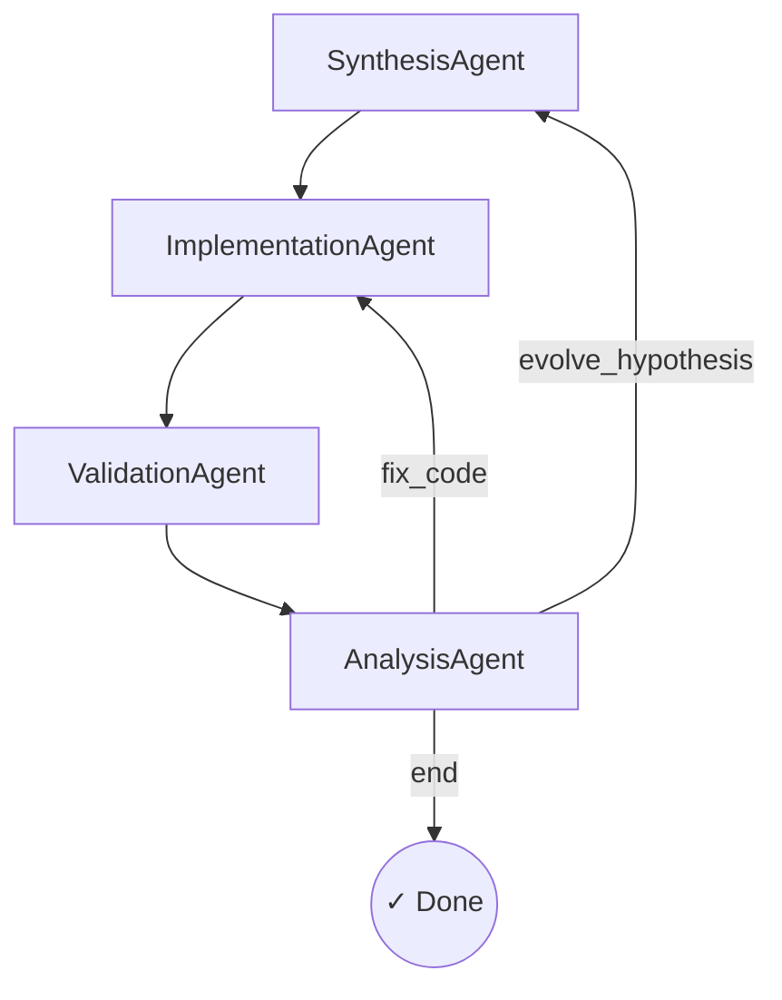

# Project AI Blue Swan

> **The Machine That Makes The Machine** — An autonomous quantitative research engine that proposes, codes, backtests, and refines stock trading strategies for the US market.

---

## System Architecture

AutoQuant implements a **self-evolving multi-agent loop** powered by LangGraph.  Four specialised agents collaborate in a directed graph, with conditional routing that enables automatic self-correction:



| Agent | Role |
|---|---|
| **SynthesisAgent** | Generates trading hypotheses and factor formulas using an LLM, informed by the full critique history |
| **ImplementationAgent** | Translates hypotheses into executable Python signal code, validates via sandboxed execution |
| **ValidationAgent** | Runs historical backtests with Walk-Forward Optimization (WFO) to prevent overfitting |
| **AnalysisAgent** | Evaluates performance metrics (Sharpe, Max DD, CAGR), identifies biases, and routes to next step |

---

## Project Structure

```
AIBlueSwan/
├── main_orchestrator.py           # LangGraph state machine entry point
├── requirements.txt               # Python dependencies
├── .env.example                   # Template for API keys
│
├── src/
│   ├── agents/                    # Multi-agent pipeline
│   │   ├── base.py                # Pydantic schemas + GraphState TypedDict
│   │   ├── synthesis.py           # Hypothesis generation (LLM + mock)
│   │   ├── implementation.py      # Code generation + sandbox validation
│   │   ├── validation.py          # Backtesting (WFO + engine)
│   │   └── analysis.py            # Metric evaluation + decision routing
│   │
│   ├── data/                      # Market data integrations
│   │   ├── yfinance_client.py     # yFinance async client (free, live, no API keys)
│   │   └── loader.py              # Unified async data loader
│   │
│   ├── backtest/                  # Backtesting engine
│   │   ├── metrics.py             # Sharpe, Sortino, Max DD, CAGR, Calmar
│   │   ├── engine.py              # Event-driven portfolio simulator
│   │   └── wfo.py                 # Walk-Forward Optimization
│   │
│   └── utils/                     # Shared infrastructure
│       ├── config.py              # Settings, NASDAQ-100 tickers, constants
│       └── executor.py            # Sandboxed code execution
│
├── data/                          # Legacy data / outputs
│
├── notebooks/                     # Jupyter analysis notebooks
└── results/                       # Strategy output artifacts
```

---

## How the Evolutionary Loop Self-Corrects

The pipeline is designed to automatically recover from failures:

### 1. Strategy Underperformance → `evolve_hypothesis`
If the AnalysisAgent determines that the Sharpe ratio, Max Drawdown, or WFO score fall below thresholds, it routes back to the **SynthesisAgent** with a detailed critique.  The SynthesisAgent uses the full critique history as context to propose a fundamentally different strategy.

### 2. Code Bugs → `fix_code`
If the ImplementationAgent produces code that fails validation (syntax errors, runtime exceptions, or zero trades generated), the AnalysisAgent routes back to the **ImplementationAgent** with the error details.  The agent regenerates the code addressing the specific failure.

### 3. Success → `end`
When a strategy achieves Sharpe > 1.5, Max DD > −20%, and WFO score > 1.0, the pipeline terminates and reports the winning strategy.

### 4. Max Iterations Safety Valve
To prevent infinite loops, the pipeline terminates after `max_iterations` (default: 5), reporting the best result achieved.

---

## Walk-Forward Optimization (WFO)

To guard against overfitting, the ValidationAgent uses **rolling in-sample / out-of-sample windows**:

```
|—— Train (252d) ——|—— Test (63d) ——|
                    |—— Train (252d) ——|—— Test (63d) ——|
                                       |—— Train (252d) ——|—— Test (63d) ——|
```

The **WFO Score** measures strategy stability:

```
WFO Score = mean(per-window Sharpes) − std(per-window Sharpes)
```

A high WFO score indicates consistent performance across time periods, while a low score suggests the strategy is overfitting to specific market regimes.

---

AutoQuant uses a multi-agent orchestrated pipeline powered by **LangGraph** and runs entirely locally. It delegates planning, coding, backtesting, and critique to multiple local **Ollama** AI models to autonomously discover and refine trading strategies without requiring any paid API keys or spending credits.

## Running Locally

### 1. Requirements
*   Python 3.10+
*   Node.js 18+ (for frontend UI)
*   **Ollama installed and running locally**
    *   Download and install Ollama from [ollama.com](https://ollama.com/)
    *   Start the Ollama background service.
    *   Pull the reasoning model: `ollama pull llama3.2`
    *   Pull the coding model: `ollama pull deepseek-coder`

### 2. Environment Setup
Clone the repository and install the dependencies:
```bash
git clone https://github.com/sudheerbez/AIBlueSwan.git
cd AIBlueSwan
python3 -m venv .venv
source .venv/bin/activate
pip install -r requirements.txt
```

### 3. Configure Environment Variables (Optional)

Create a `.env` file in the project root if you want to override the default local ports or models. Out of the box, AutoQuant requires **zero API keys**.

```bash
# ----- Local LLM Setup (Ollama) -----
OLLAMA_BASE_URL=http://localhost:11434
DEFAULT_LLM_MODEL=llama3.2
CODER_LLM_MODEL=deepseek-coder
```

> **Note**: AutoQuant now relies entirely on `yfinance` to fetch live historical data. No Alpha Vantage, FMP, or external cloud LLM accounts are required.

### 3. Run the Orchestrator

```bash
# Default run: 5 iterations, $100K capital, NASDAQ-100
python main_orchestrator.py

# Custom configuration
python main_orchestrator.py --iterations 10 --capital 200000

# Full options
python main_orchestrator.py --help
```

---

## Inter-Agent Communication

All agents communicate through **structured JSON** using Pydantic schemas.  This ensures deterministic, type-safe data passing:

| Schema | Producer | Consumer |
|---|---|---|
| `Hypothesis` | SynthesisAgent | ImplementationAgent |
| `FactorCode` | ImplementationAgent | ValidationAgent |
| `BacktestResult` | ValidationAgent | AnalysisAgent |
| `Critique` | AnalysisAgent | SynthesisAgent (loop) |
| `ErrorReport` | Any agent | AnalysisAgent |

---

## Extending the System

### Adding a New Data Source
1. Create `src/data/your_source.py` following the `YFinanceClient` pattern
2. Register it in `src/data/loader.py` as a new source option
3. Add the API key to `.env.example` and `src/utils/config.py`

### Swapping the Backtesting Engine
1. Implement the `BacktestEngine` interface (`.run(signal_fn, price_data) → BacktestResult`)
2. Update `ValidationAgent` to use your engine
3. Popular alternatives: Backtrader, Qlib, Zipline

### Adding New Metrics
1. Add metric functions to `src/backtest/metrics.py`
2. Add fields to the `BacktestResult` schema in `src/agents/base.py`
3. Update `AnalysisAgent` thresholds in `src/utils/config.py`
